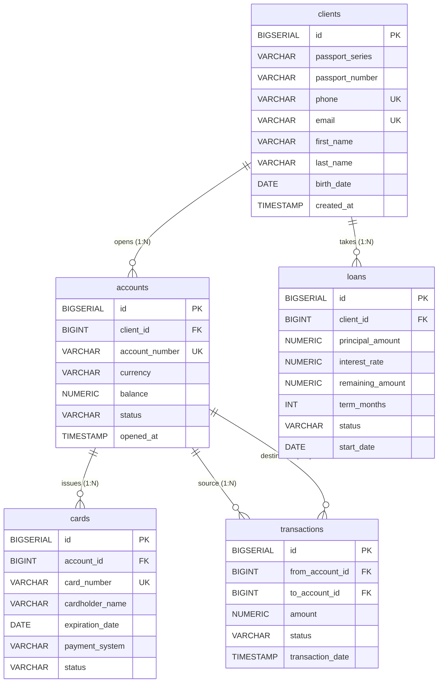

```mermaid
erDiagram
    clients ||--o{ accounts : "opens (1:N)"
    clients ||--o{ loans : "takes (1:N)"
    accounts ||--o{ cards : "issues (1:N)"
    accounts ||--o{ transactions : "source (1:N)"
    accounts ||--o{ transactions : "destination (1:N)"

    clients {
        BIGSERIAL id PK
        VARCHAR passport_series
        VARCHAR passport_number
        VARCHAR phone UK
        VARCHAR email UK
        VARCHAR first_name
        VARCHAR last_name
        DATE birth_date
        TIMESTAMP created_at
    }

    accounts {
        BIGSERIAL id PK
        BIGINT client_id FK
        VARCHAR account_number UK
        VARCHAR currency
        NUMERIC balance
        VARCHAR status
        TIMESTAMP opened_at
    }

    cards {
        BIGSERIAL id PK
        BIGINT account_id FK
        VARCHAR card_number UK
        VARCHAR cardholder_name
        DATE expiration_date
        VARCHAR payment_system
        VARCHAR status
    }

    transactions {
        BIGSERIAL id PK
        BIGINT from_account_id FK
        BIGINT to_account_id FK
        NUMERIC amount
        VARCHAR status
        TIMESTAMP transaction_date
    }

    loans {
        BIGSERIAL id PK
        BIGINT client_id FK
        NUMERIC principal_amount
        NUMERIC interest_rate
        NUMERIC remaining_amount
        INT term_months
        VARCHAR status
        DATE start_date
    }
```